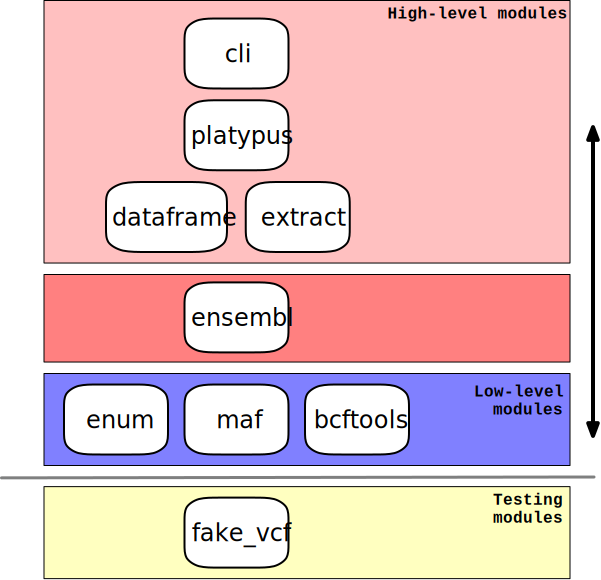

Design
======

===
CLI
===

A command-line application, also named ``varona`` is included to execute
the main functionality of the library.  The command-line application has a few
options to select including how to calculate the minor allele frequency,
which genome assembly to use for the Ensembl API (`GRCh37 <http://grch37.rest.ensembl.org/>`_,
or `GRCh38 <http://rest.ensembl.org/>`_, with GRCh37 being the default),
and the verbosity of the logging output.

==============
Python Library
==============

A major design goal with Varona is to have a flexible and extensible
programmatic interface. Because the output of Varona is a CSV file, the natural
progenitor of a CSV file is a DataFrame.  Varona will create two types of
DataFrames and join the two together: (a) a DataFrame based on the data embedded
in the VCF file only, and (b) a DataFrame based on the data obtained from the
Ensembl API.  Many times when a CSV file is created for someone, they will
add or remove columns to suit their needs. The exact data extracted from the
VCF records or the API can be adjusted by supplying alternative callback
functions, each of which returns a list of dictionaries each corresponding to
a DataFrame row. A different approach to callback functions could've been to
define a base class and let the programmer define subclasses but for this
version, the callbacks should provide a fair amount of flexibility.

   Modules in the Varona library and where they roughly lie on the spectrum of low to high level interface.

.. raw:: html

    

"Bring your own extractor"
--------------------------
The two functions in :doc:`varona.extract` are the **extractors** used by the
main function in :doc:`varona.varona`, and the command-line application, but
are meant to be replaced by an analyst with functions to suit their needs. 

===========
Ensembl API
===========

The Ensembl API provides auxiliary information about the variants in the VCF file.
When it comes to the approach for querying their REST API, the approach here is
to query in 200 variant chunks sequentially without multiple connections, threads,
or asynchronicity.  For 1 to 50,000 variants, this is a suitable approach.  The
speed observed tends to be about 10-20 variants per second processed, at least
using the parameters Varona uses.  If there's a need to process hundreds of
thousands or millions of variants, then it's worth considering adding some
parallelism and asynchronous capability.  The `httpx <https://www.python-httpx.org/>`_ library was choseon for
making the HTTP requests because of its async compatibility as a future option.
