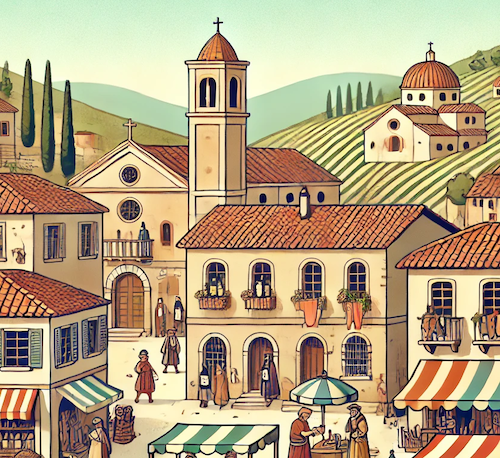

Varona
======

.. raw:: html

    

"Varona" is named as a near-portmanteau of "variant" and "annotation".
Actually, the near-portmanteau was originally conceived as "Verona", in
homage to Italian city home to Romeo and Juliet. However, after seeing
that a `Verona PyPi library already exists <https://pypi.org/project/verona/>`_, "Varona" was chosen.

.. toctree::
   :maxdepth: 6
   :hidden:

   goal
   design
   installation
   api

